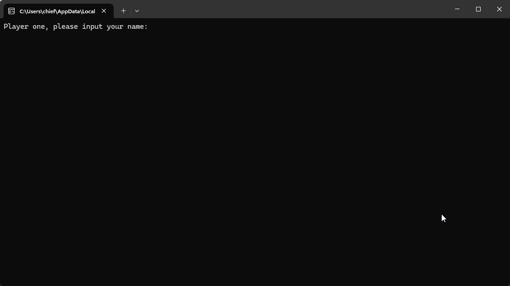

# Pica-Centro Game

Welcome to **Pica-Centro**, a fun number-guessing game where two players take turns to guess a secret number. The game is inspired by the classic "Pico, Fermi" game, where players have a limited number of guesses to figure out a secret number based on feedback (picas and centros).

## 📜 How to Play

1. **Player One**: You will choose a secret number. The number will consist of 3 digits (0-9) and must be kept secret from Player Two.
2. **Player Two**: You will try to guess the secret number. After each guess, Player One will provide feedback:
    - **Pica**: A digit from your guess exists in the secret number, but not in the correct position.
    - **Centro**: A digit from your guess is in the correct position.
3. You have **10 guesses** to figure out the secret number.

## 🧠 Game Logic

- **Guesses**: Player Two has a total of 10 attempts to guess the secret number.
- **Feedback**: After each guess, Player One provides feedback in terms of picas and centros.
  - **Centro**: A correct digit in the correct position.
  - **Pica**: A correct digit in the wrong position.

## ⚙️ Features

- **2 Player Game**: Two players interact with the game. Player One provides the secret number, and Player Two guesses it.
- **Input Validation**: The game ensures that only digits (0-9) are entered for the secret number and guesses.
- **ASCII Art**: Fun ASCII art for winning and losing messages to make the game more enjoyable.

## 📖 How to Run

1. Make sure **Python 3** is installed on your system.
2. Clone or download this repository.
3. Save the Python script as `pica_centros_game.py`.
4. Open a terminal/command prompt and run the game:

   ```bash
   python pica_centros_game.py

OR 
1. Open the `.sln` (Visual Studio Solution) file in **Microsoft Visual Studio**
2. Press `Ctrl + F5` or click **Run** to execute the program

## Demo Output


